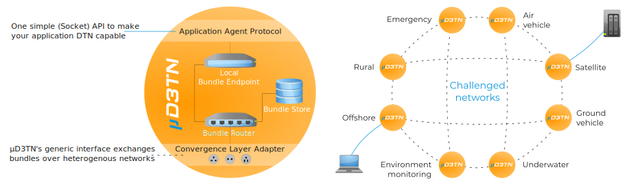

# Home

***Hello and thank you for your interest in µD3TN!***

This page serves as a starting point for the documentation, guiding you through the essential information needed to work effectively with µD3TN.

## About µD3TN

**µD3TN** (pronounced "Micro-Dee-Tee-En") is a free, lean, and space-tested **DTN protocol implementation**, for which we offer [enterprise-support](https://d3tn.com/ud3tn.html#product-pricing). It runs on **POSIX and Linux** operating systems and can be easily adapted to a variety of challenged networks. The [source code](https://gitlab.com/d3tn/ud3tn) is available under **BSD license**.

??? question "What is Delay- and Disruption-tolerant Networking (DTN)?"

    [Delay- and Disruption-Tolerant Networking (DTN)](https://en.wikipedia.org/wiki/Delay-tolerant_networking) is a network architecture designed to enable reliable communication in environments with **intermittent or unreliable connectivity**, such as deep space, maritime, or remote areas. The [DTN architecture](https://datatracker.ietf.org/doc/html/rfc4838) uses **store-and-forward techniques**, where data is stored at intermediate nodes and forwarded when a connection becomes available, ensuring eventual delivery even over **long delays or frequent disruptions**. This approach contrasts with traditional networks (like the Internet), which assume continuous connectivity, making DTN ideal for **challenging and delay-prone communication scenarios**.

### What does µD3TN provide?

A general introduction of µD3TN is available on its [project website](https://d3tn.com/ud3tn.html) and in [our video series on YouTube](https://www.youtube.com/watch?v=ETs_BgazRJI&list=PLED8xrzySss-B2966X98dwLLb1BJQu6Ua).

**µD3TN currently implements:**

- Bundle Protocol version 6 ([RFC 5050](https://datatracker.ietf.org/doc/html/rfc5050)),
- Bundle Protocol version 7 ([RFC 9171](https://datatracker.ietf.org/doc/html/rfc9171)),
- Several Bundle Protocol convergence layers, such as:
    - MTCP ([draft version 0](https://datatracker.ietf.org/doc/html/draft-ietf-dtn-mtcpcl-00)),
    - TCPCLv3 ([RFC 7242](https://datatracker.ietf.org/doc/html/rfc7242)),
    - CCSDS Space Packet Protocol ([SPP](https://public.ccsds.org/Pubs/133x0b2e2.pdf)),
    - BIBE ([draft version 3](https://datatracker.ietf.org/doc/html/draft-ietf-dtn-bibect-03), see [this](./Bundle-in-Bundle Encapsulation_(BIBE).md) documentation),
- A persistent storage backend based on SQLite (see [here](./sqlite-storage.md)).

!!! tip "µD3TN is your go-to solution for ensuring reliable data communication in any kind of network - even in challenging, delay-prone environments where traditional networks fall short!"

## How to use this documentation?

- **If you're new to µD3TN**, start with the [**Quick Start Guide**](./posix_quick_start_guide.md). It won't cover every detail, but it gives a great overview of what µD3TN can do and how to set it up.

- The **Usage** section provides more detailed instructions and explores additional use cases to help you get the most out of µD3TN.

- **Development** covers advanced topics and resources for developers, including guides on data formats, performance profiling, and contributing to µD3TN.

- Lastly, **References** includes API documentation and research papers that provide in-depth technical details and theoretical background.

**Additional Resources and External Information:**

- The **directory structure** and **command-line usage** are explained in the [**README**](https://gitlab.com/d3tn/ud3tn/-/blob/master/README.md?ref_type=heads) for easy reference.
- Furthermore, you can review the **Changelog** [here](https://gitlab.com/d3tn/ud3tn/-/blob/master/CHANGELOG) to help decide which [µD3TN version](https://gitlab.com/d3tn/ud3tn/-/releases) best suits your needs.

 

***If you have any questions or feedback, don’t hesitate to reach out to us via [contact@d3tn.com](mailto:contact@d3tn.com).***

***Enjoy exploring and innovating with µD3TN!***
